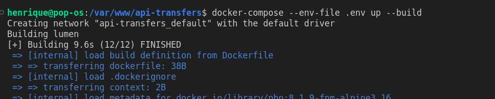
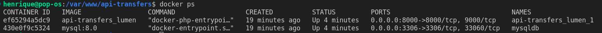
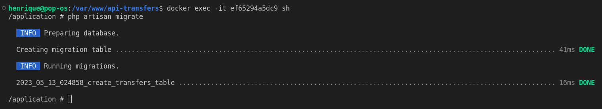
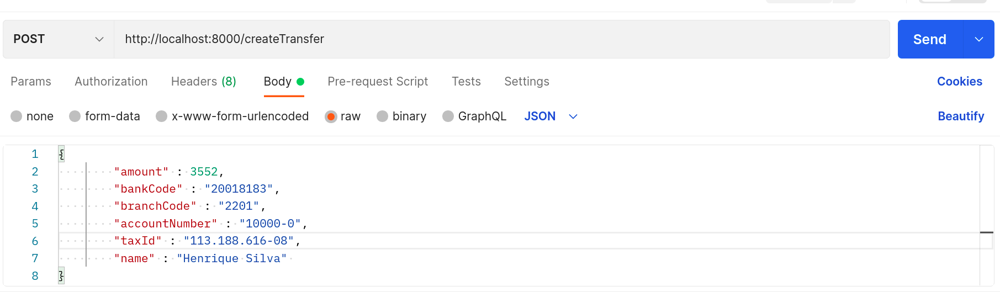
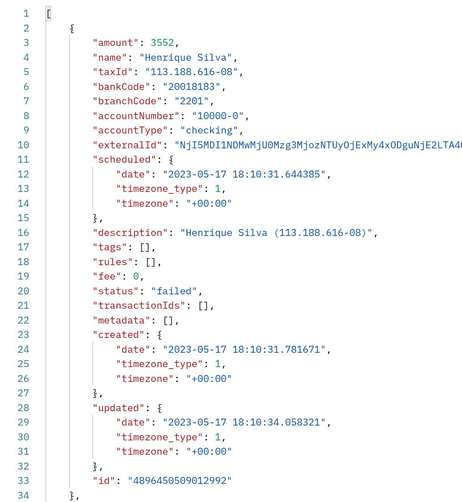

<h1 align="center"> API de transferência bancaria.</h1>

 A API possui um endpoint para solicitação de um pagamento via transferência, e caso a transferência seja bem sucedida ela armazena a URL do comprovante em PDF no banco de dados e na Amazon S3, é utilizada a Api da Stark Bank para realizar a transferência, obter as transferências que foram realizadas e as informações sobre as mesmas. Foi desenvolvida utilizando o framework Lumen com container Docker.   

  <a href="#-tecnologias">Tecnologias</a>&nbsp;&nbsp;&nbsp;|&nbsp;&nbsp;&nbsp;
  <a href="#-projeto">Projeto</a>&nbsp;&nbsp;&nbsp;|&nbsp;&nbsp;&nbsp;
  <a href="#memo-licença">Licença</a>

  

 

  

## 🚀 Tecnologias

Esse projeto foi desenvolvido com as seguintes tecnologias:

- Laravel/Lumen Versão LTS 
- Docker/Docker-compose
- Composer
- Amazon S3
- Git e Github
    
## 💻 Projeto

Passos para execução do projeto:  

Através de algum terminal execute o seguinte comando:   
`git clone https://github.com/HenriqueMVSS/api-transfers-lumen`  

 ### Ferramentas obrigatórias  
    
    - PHP ^8.0
    - Docker/Docker-compose
    - Composer
    - Mysql
    - Postman ou Insomnia
 

### CONFIGURAÇÃO DO AMBIENTE

    Tem um arquivo com o nome .env-example, iremos fazer uma cópia desse arquivo e renomear a copia para .env nele iremos preencher as variaveis ambientes de acordo com as sua configuração.

- ### Antes de prosseguir  com os próximos passos, verifica se as ferramentas citadas acima estão instaladas.   

### Após concluir o clone do repositório:  

    Certifique-se que tem o composer instalado em sua máquina, em um terminal na raiz do projeto execute o comando composer install para instalar as dependências do projeto.

### Inicialização da aplicação:  

    Certifique-se que tem docker e o docker-compose instalados em sua máquina, em um terminal na raiz do projeto docker-compose --env-file .env up --build para criar o container e realizar uma cópia atualizada da aplicação para o container.
 

     Print-screen do terminal após execução do comando acima: 
 
  

    
  

    

    Com o container em execução, no terminal executa docker ps para listar os containers ativos, e localiza a ID referente ao container da aplicação ou o nome do container e executa o comando docker exec -it AQUI VOCÊ VAI COLOCAR O ID OU NOME DO CONTAINER sh para entrar no terminal do container.
    
 
    

     Print-screen do terminal após execução do comando acima: 
 
  

    
  

    Nesse exemplo do print acima optei por utilizar o ID do container, ficando o comando dessa forma docker exec -it ef65294a5dc9 sh
 

### Criando a de tabela no banco de dados do container  

    Após execução do comando acima, executa php artisan migrate para criação das tabelas no banco de dados.

 
    

     Print-screen do terminal após execução do comando acima: 
 
  

    
  

   
 

### Executando a aplicação

    Após os passos acima e com o Postman ou Insomnia instalados, vamos utilizar-los para criação das transferências, através de uma requisição POST, os dados obrigatórios para criar uma transferência são:

    {
        "amount" : 3552,
        "bankCode" : "20018183",
        "branchCode" : "2201",
        "accountNumber" : "10000-0",
        "taxId" : "113.188.616-08",
        "name" : "Henrique Silva" 
    }

  
 
    

     Nesse exemplo abaixo utilizei o postman para criação da transferência: 
 
  

    
  

   
   

    Acabamos de criar nossa primeira transferência, se for bem sucedida iremos ter o seguinte retorno: 
 

    
  

    Além da transferência que criamos, a api também ira fazer uma requisição trazendo todas as transferências que foram realizadas anteriormente.

## :memo: Licença

Esse projeto está sob a licença MIT.

---
